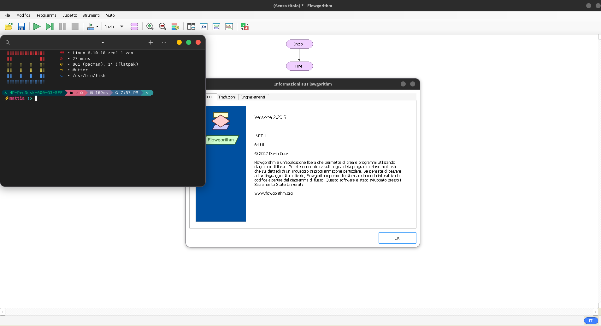

# Flowgorithm on Linux

This is a simple script to install flowgorithm on Linux through Wine and Wineget.
Flowgorithm don't require particular dependencies and is very easy to install and update.

Enjoy!



debian base

```sh
sudo apt install wine -y
```

arch base

```sh
sudo pacman -Syu wine --noconfirm
```

fedora base

```sh
sudo dnf install wine -y
```
bug fix wine mono
```sh
wget https://dl.winehq.org/wine/wine-mono/9.3.0/wine-mono-9.3.0-x86.msi && wine wine-mono-9.3.0-x86.msi
```
